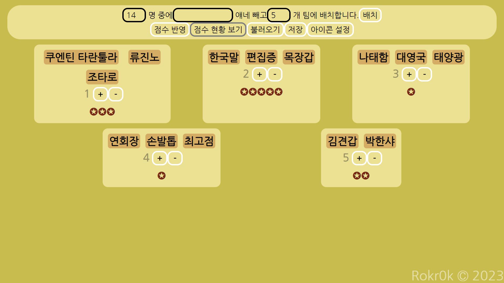

# Team Up&excl;

랜덤으로 팀을 짜고 점수를 주고 관리하는 프로그램

[바로가기](https://rokr0k.xyz/teamup/)

## 사용 방법



### 각 버튼, 입력창 설명

1. 총 인원 수.
2. 제외할 인원들. 공백 문자로 구별함.
3. 할당할 팀 수.
4. 배치 실행.
5. 가장 점수가 높은 팀의 팀원들에게 1점씩 부여.
6. 마우스를 올리면 현재 개인 스코어 확인 가능.
7. 정보가 저장되는 파일 로드.
8. 정보를 파일로 저장.
9. 점수를 표기할 아이콘 설정.

### 정보 저장

정보는 CSV 파일로 저장됨.

예시(맨 위 칸은 미포함):
|이름|점수|
|-|-|
|김견갑|1|
|나태함|0|
|대영국|3|
|류진노|2|
|목장갑|0|
|박한샤|2|
|손발톱|2|
|연회장|2|
|조타로|3|
|최고점|2147483647|
|쿠엔틴 타란툴라|4|
|태양광|0|
|편집증|0|
|한국말|1|

한국어판 Windows를 사용하는 절대 다수의 이용자들(특히 공무원직)을 위해 EUC-KR 인코딩을 사용합니다. ~~&#x1F92C;~~

## 빌드 및 로컬에서 실행

Node.js, NPM 환경이 필요합니다.

1. 프로젝트를 복사합니다.

   ```sh
   git clone https://github.com/Rokr0k/teamup.git
   cd teamup
   ```

2. NPM 종속성을 설치합니다.

   ```sh
   npm install
   ```

3. 테스트서버를 실행합니다. (localhost:3000으로 실행됨)

   ```sh
   npm start
   ```

4. 프로그램을 빌드합니다. (`dist/` 디렉토리에 결과 생성)

   ```sh
   npm run build
   ```

## 프로젝트 기여

1. 해당 프로젝트를 포크(Fork)합니다.

2. 본인 GitHub 계정에 추가된 프로젝트를 복사합니다.

   ```sh
   git clone https://github.com/<본인 아이디>/teamup.git
   cd teamup
   ```

3. `main` 브랜치를 기준으로 개발을 진행합니다.

4. 해당 프로젝트의 `main` 브랜치를 대상으로 Pull Request를 만듭니다.

프로젝트에 기여할 때 유념할 사항이 있습니다.

- 새로운 기능을 구현할 경우, 스크린샷을 갱신하고 설명을 추가해 주십시오.  
  아니면 제가 해야 하는데, 그러면 커밋 수가 폭발할 것입니다.
- 프로그램 실행에 지장이 없도록 오류를 수정해주십시오.  
  그 어떤 신들린 패치를 갖고와도 실행이 안되면 못 받아줍니다.
- Lint를 최대한 준수하고, 코드를 포맷팅해주십시오.  
  코드를 일관성 있게 유지하는 것은 협업에 도움이 됩니다.

## 라이선스

해당 프로그램은 MIT 라이선스를 통해 배포됩니다.
